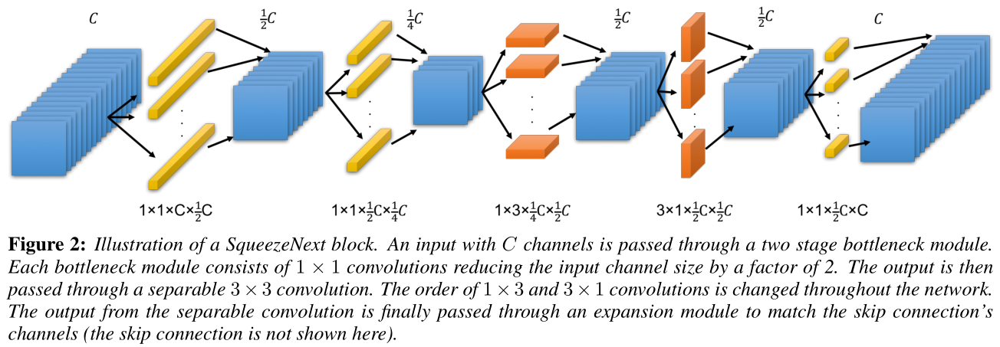
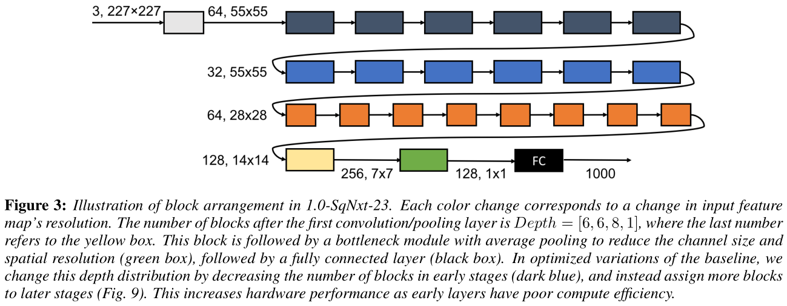

# SqueezeNext: Hardware-Aware Neural Network Design

## Introduction
The codes are [PyTorch](https://pytorch.org/) re-implement version for paper: SqueezeNext: Hardware-Aware Neural Network Design. (SqueezeNext)

> Gholami A, Kwon K, Wu B, et al. SqueezeNext: Hardware-Aware Neural Network Design[J]. 2018. [arXiv:1803.10615v1](https://arxiv.org/abs/1803.10615v1)

We implement this work from [amirgholami/SqueezeNext](https://github.com/amirgholami/SqueezeNext).

## Structure
Here, we use a variation of the latter approach by using a two stage squeeze layer.  In each SqueezeNext block, we use two bottleneck modules each reducing the channel size by a factor of 2, which is followed by two separable convolutions. We also incorporate a final 1 × 1 expansion module, which further reduces the number of output channels for the separable convolutions.

## Requirements
- jupyter notebook
- Python3
- PyTorch 0.4

## Results
We just test four models in three datasets: Cifar10, Cifar100 and [Tiny ImageNet](https://tiny-imagenet.herokuapp.com/)

### Cifar-10

Models         | train(Top-1) | validation(Top-1) | width  | depth  |
-------------  | ------------ | ----------------- | ------ | ------ |
SqNxt_23_1x    | 98.7         | 91.9              | 1.0x   | 23     |
SqNxt_23_2x    | 99.9         | 93.1              | 2.0x   | 23     |
SqNxt_23_1x_v5 | 99.4         | 91.9              | 1.0x   | 23     |
SqNxt_23_2x_v5 | 99.8         | 93.1              | 2.0x   | 23     |

### Cifar-100

Models         | train(Top-1) | validation(Top-1) | width  | depth  |
-------------  | ------------ | ----------------- | ------ | ------ |
SqNxt_23_1x    | 94.1         | 69.3              | 1.0x   | 23     |
SqNxt_23_2x    | 99.7         | 73.1              | 2.0x   | 23     |
SqNxt_23_1x_v5 | 94.7         | 70.1              | 1.0x   | 23     |
SqNxt_23_2x_v5 | 99.8         | 73.2              | 2.0x   | 23     |

### Tiny ImageNet

Models         | train(Top-1) | validation(Top-1) | width  | depth  |
-------------  | ------------ | ----------------- | ------ | ------ |
SqNxt_23_1x    | 71.1         | 53.5              | 1.0x   | 23     |
SqNxt_23_2x    | 77.2         | 56.7              | 2.0x   | 23     |
SqNxt_23_1x_v5 | 70.9         | 52.7              | 1.0x   | 23     |
SqNxt_23_2x_v5 | 72.4         | 56.7              | 2.0x   | 23     |